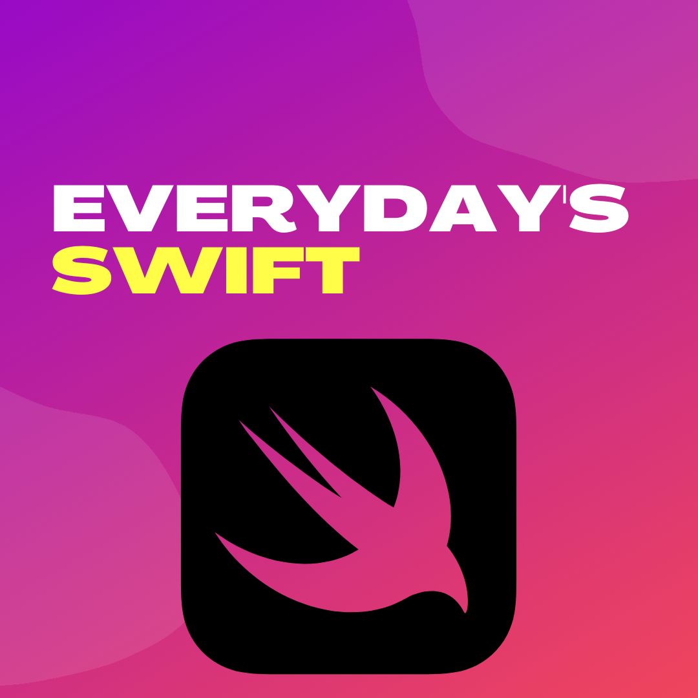

  

# Everydays-Swift
--
Code from Youtube video series **Everyday's swift**:  
<a href="https://www.youtube.com/channel/UCuJ2oLnFjBfBrArVvPtdeDw">

  

 </a>
 [Watch on Youtube](https://www.youtube.com/channel/UCuJ2oLnFjBfBrArVvPtdeDw)

## Video List: 
1. [AppDelegate in SwiftUI](Everydays-Swift/tree/main/Video-1/)

Everyday's Swift is Series by Alok Choudhary.  
Reach me out: [htttp://alokchoudahry.com](htttp://alokchoudahry.com) 
